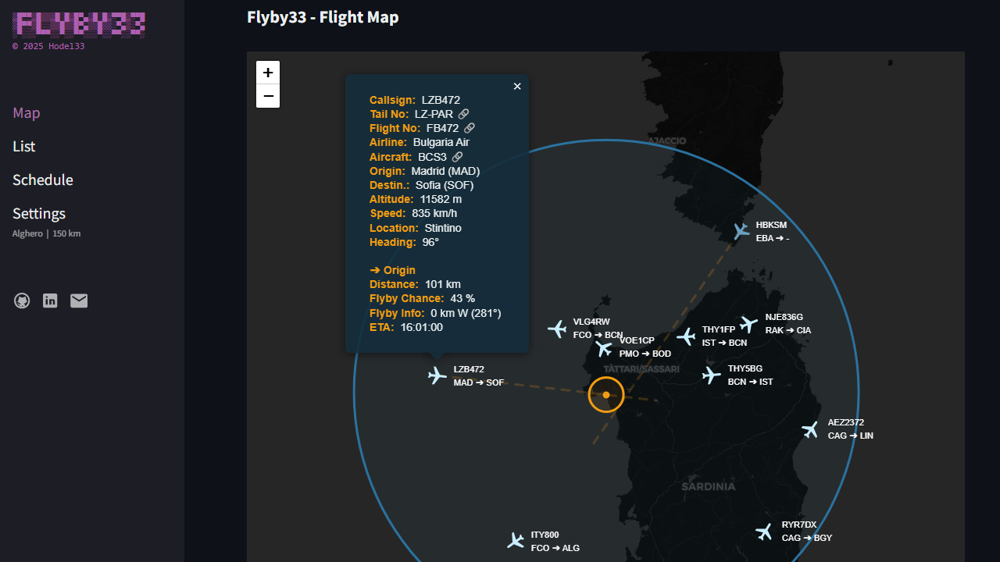
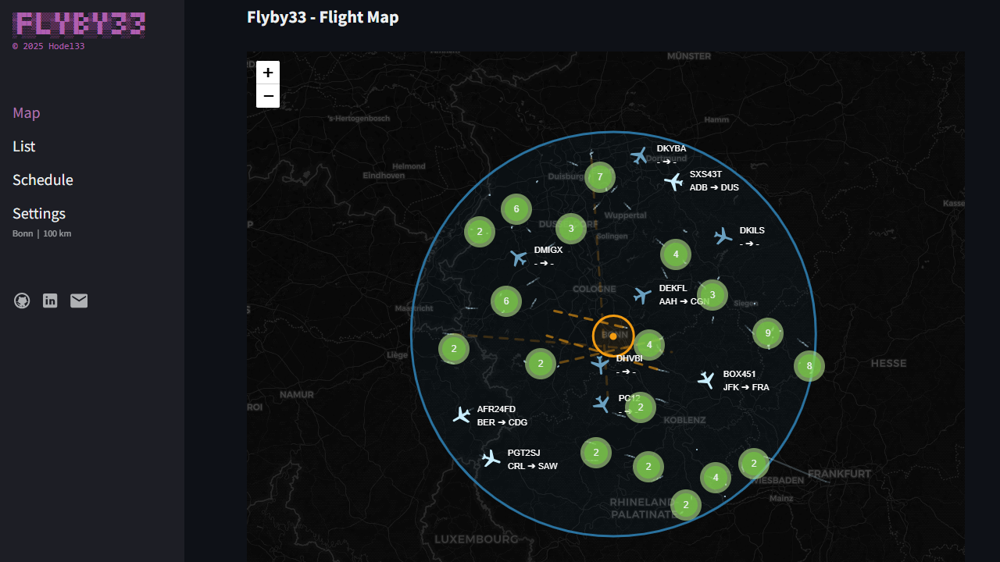
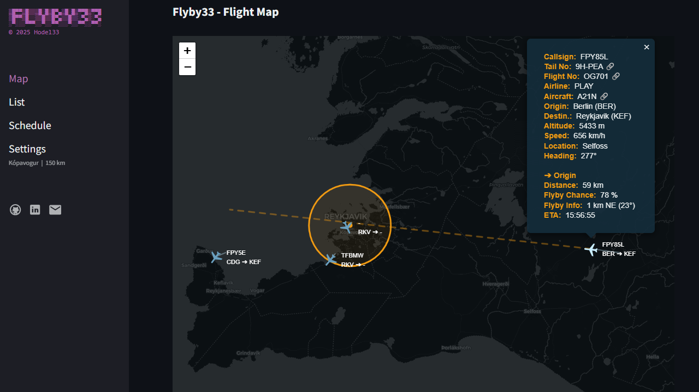
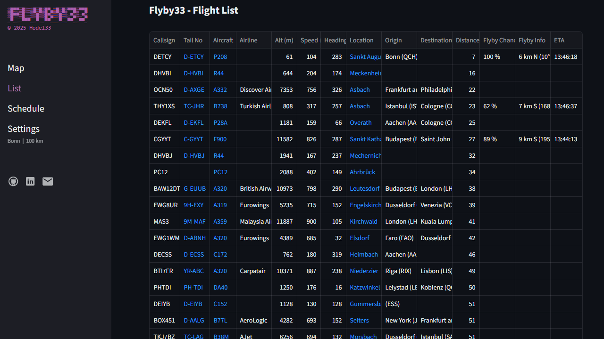
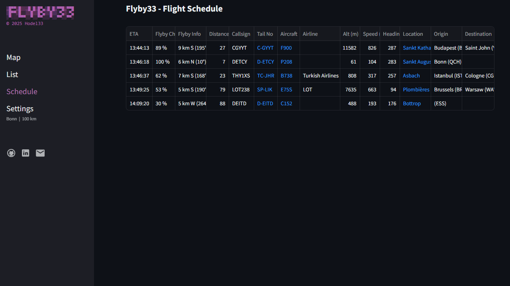
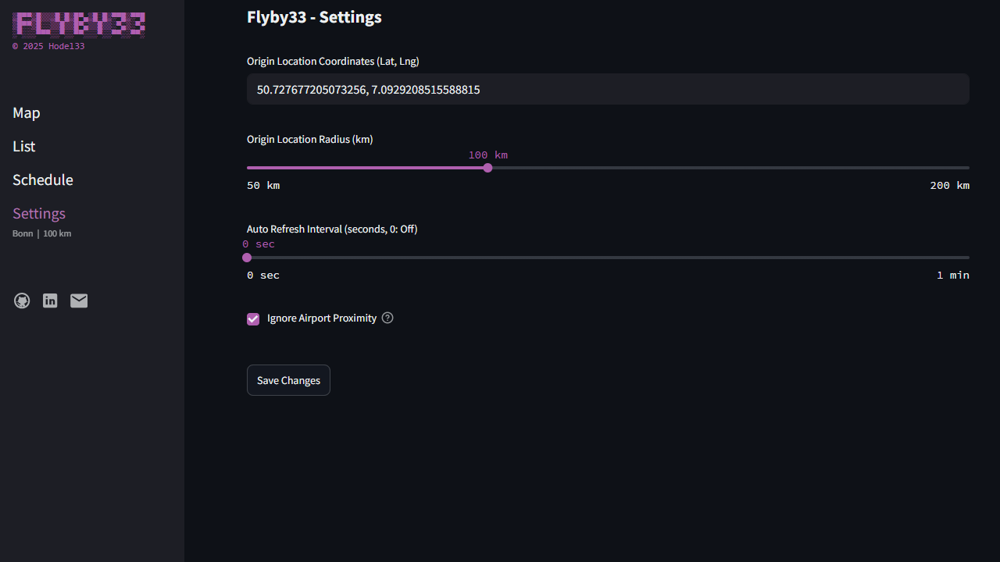
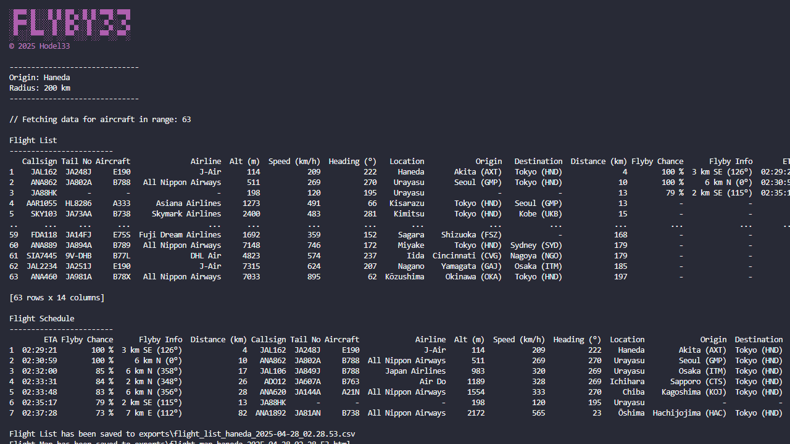
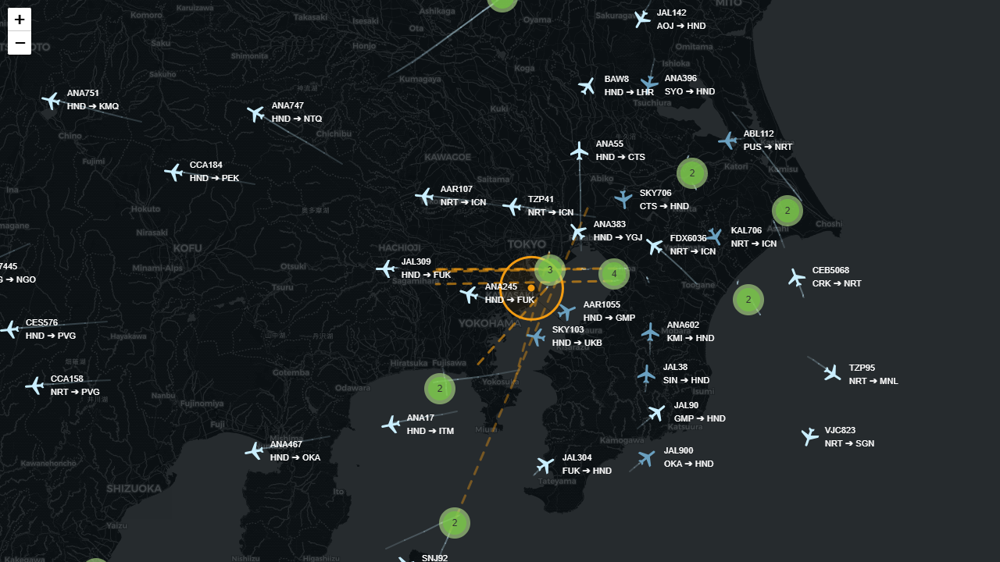
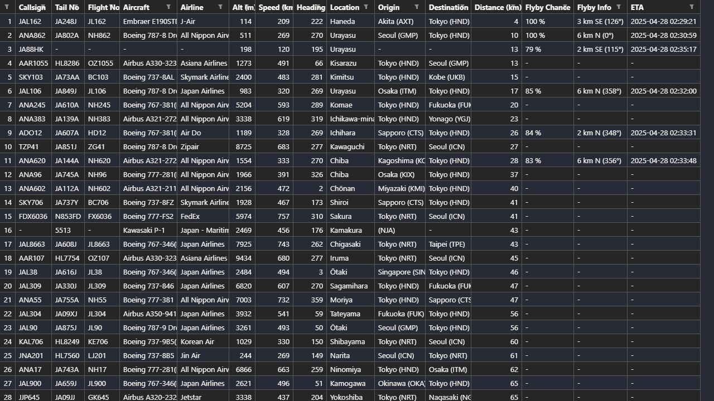
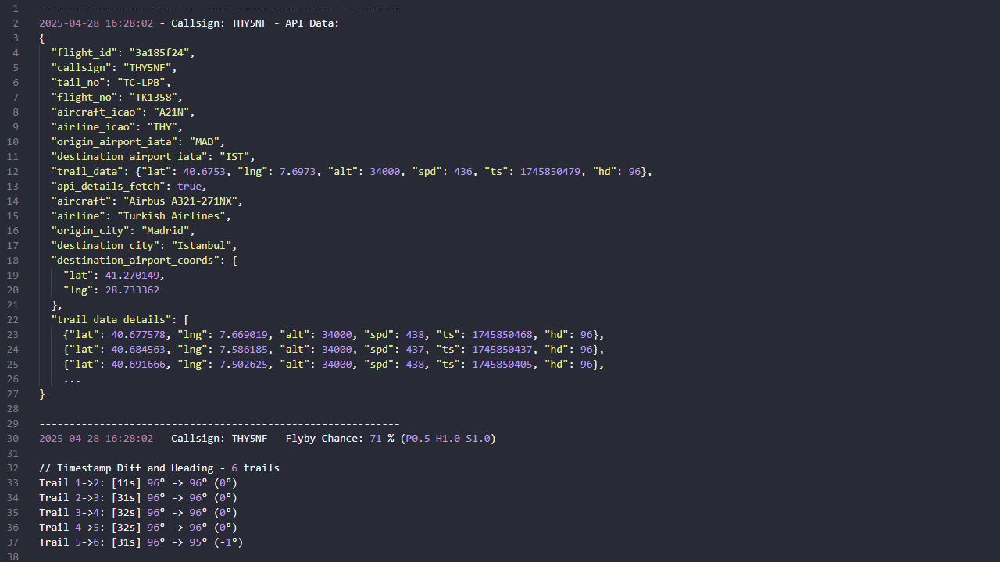

# Flyby33 ✈️

## 📋 Overview

**Flyby33** is a flyby prediction tool that monitors aircraft in real-time, showing which are likely to pass a location of your choosing while estimating their arrival time, approach direction and providing detailed flight information. Perfect for aviation enthusiasts, planespotters or anyone curious about the aircraft flying overhead.

The application fetches data from **Flightradar24**, processes it to determine which flights will pass near the chosen location, and presents this information through either an interactive **Streamlit** web interface or as exportable **Folium** HTML maps and CSV files for offline viewing by running the terminal script.

> **Important Usage Note:**
This tool is intended ONLY for private and educational purposes. It must NOT be used commercially or for any profit-generating activities. Users agree to use the application strictly for personal learning and aviation enthusiast interests, in compliance with Flightradar24's terms of service.<br>
If you are interested in accessing Flightradar24 data commercially, please go to the offical [Flightradar24 API](https://fr24api.Flightradar24.com) page.

<br>

### 🌟 Features

- **Flyby Predictions**: Estimate the probability of aircraft flying near your specified location based on heading, speed and distance analysis

- **Arrival Time and Approach Information**: Calculate the arrival time for when aircraft will reach their closest point to your location, the expected distance at closest approach, and from which direction they will approach, based on predictions that assume consistent heading and speed

- **Comprehensive Flight Details**: Access detailed information including callsign, tail number, aircraft type, airline, origin, destination, altitude, speed, heading and distance from location

- **Interactive Map**: View all flights in your area with color-coded aircraft icons (darker blue for low-altitude flights under 3000 meters, lighter blue for higher altitudes), projected flight paths shown as dotted orange bearing lines with transparency indicating flyby probability and historical trail lines showing recent flight paths

- **Flight List**: Access a detailed interactive table of all aircraft in the region with sortable data

- **Flyby Schedule**: View a specialized schedule page showing only aircraft with predicted flybys, organized by estimated arrival time

- **Auto-Refresh**: Set automatic data refresh intervals to keep information current

- **Custom Location**: Configure any location coordinates and monitoring radius anywhere in the world

- **External Links**: Direct links to Flightradar24 for additional flight information and Skybrary for aircraft specifications

- **Web Interface Option**: Access all features through a user-friendly Streamlit web interface with organized pages and interactive components

- **Terminal Mode**: Run the script directly to generate an interactive Folium map HTML file and CSV data export for offline viewing

- **SQLite Database**: Store and retrieve flight data automatically through an SQLite database, enabling persistence across sessions and efficient access to historical flight information

<br>

## ⚙️ Installation

### 🛠️ Installation Steps

1. 🐍 **Install Python**
   - Download and install Python 3.11 or higher from [Python's official website](https://www.python.org/downloads/)
   - **Tip**: During installation, make sure to check "Add Python to PATH"
   - Verify installation by opening a terminal and running:
     ```bash
     python --version
     ```

2. ⬇️ **Download Project Files** (Repository)

   You have two primary methods to obtain this project:

   A. **Direct ZIP Download**:
   - Visit the GitHub repository: https://github.com/hodel33/flyby33
   - Click the green "Code" button and select "Download ZIP"
   - Extract the downloaded ZIP file to your desired location

   B. **Git Clone** (recommended for developers):
   - Open a terminal
   - Run the following command:
   ```bash
   git clone https://github.com/hodel33/flyby33.git
   ```

3. 📦 **Install Project Dependencies** (Python packages used in this project)

   The required Python packages for this project to work properly are listed in `requirements.txt`. You can install them automatically by opening a terminal and running the command:

   ```bash
   pip install -r requirements.txt
   ```

   > On some systems, you might need to use `pip3` instead of `pip` if you have multiple Python versions installed (to specifically target Python 3)

### ℹ️ Additional Requirements

- 🌎 **Internet**: Internet connection for accessing Flightradar24 real-time data and a Web Browser if you're going to use the Streamlit web interface.

- 🖋️ **IDE (Optional)**: For code editing, [VS Code](https://code.visualstudio.com/) is recommended. As well as adding the [Python extension for VS Code](https://marketplace.visualstudio.com/items?itemName=ms-python.python).

<br>

## 🔧 Configuration

The application's behavior is controlled by the `config.ini` file.<br>Below is a sample configuration:

```ini
[Settings]
location_coords = 21.33, -157.98    # Coordinates (Lat, Lng) - Example: Hawaii coordinates
location_radius = 100               # Radius in kilometers (50, 100, 150, 200)
auto_refresh_interval = 30          # Refresh interval in seconds (0: Off, 15, 30, 60)
ignore_airport_proximity = False    # Set to True to include flights landing at nearby airports
debug_mode = False                  # Enable for detailed logging (terminal version)
```

> - For **Terminal Script**: Configuration in `config.ini` is mandatory before running.
> - For **Streamlit Interface**: Settings can be adjusted in the web interface.

<br>

## 🚀 Running the Application

You can run Flyby33 in two ways: through the Streamlit web interface or directly in the terminal.

### Option 1: Streamlit Web Interface

   ```bash
   # Run Streamlit
   streamlit run streamlit_app.py --server.headless true
   ```

   Use the `Network URL` or `External URL`. Avoid using the `Local URL`, as it can trigger `HTTP Error 451` restrictions from Flightradar, potentially disrupting the application's link functionality.

   > We are using the extra argument `--server.headless true` because we don't want it to automatically open the `localhost Local URL` in a new browser tab. This argument also enables `External URL` which is essential if we want to use the Streamlit app on other devices.

### Option 2: Terminal Version

   ```bash
   # Run Terminal Version
   python main.py
   ```

### Platform-Specific Notes:

**Windows Users:**

Use convenient scripts in `startup_scripts` folder which you can double-click to run:

1. Copy `.bat` files to main project directory
2. Double-click to run

**macOS**

1. Copy `.command` files to main project directory

2. Open Terminal and Navigate to the Parent Folder Containing the Project

```
/parent_folder
└── Flyby33
    ├── main.py
    ├── streamlit_app.py
    └── ... (other project files)
```

   - Use any of the methods:
      * Control-click the folder in the path bar to open a new Terminal window
      * Drag the folder into the terminal
      * Use `cd` command to change to the project directory


3. Make Scripts Executable (Grant Permission)

   Run the command:

```bash
# Give full permissions to the folder
chmod -R 755 Flyby33
```

4. Now you should always be able to double-click the `.command` script files.

<br>

## 🖥️ Streamlit Web Interface

The Streamlit interface offers a user-friendly way to interact with Flyby33. It consists of four main pages:

### Map Page
* **Interactive Map**: Shows all flights in your monitoring radius
* **Flight Details**: Click on any aircraft to see detailed information
* **Visual Indicators**:
   * Color-coded aircraft icons pointing in the direction of their current heading (darker blue for low-altitude flights under 3000 meters, lighter blue for higher altitudes)
   * Dotted orange lines indicate projected flight paths with transparency reflecting flyby probability 
   * Historical trail lines showing recent positions with gradient opacity (newer positions more visible than older ones) 
   * Orange circles represent your chosen location and the flyby radius (10 km)

<br>







<br>

### Flight List Page
* View all flights in your area sorted by distance from origin location (you can change the sorting to your preference)
* See comprehensive details including callsign, tail number, aircraft type, airline, origin, destination, altitude, speed, heading and distance from location
* Clickable links to Flightradar24 for additional flight information, Skybrary for aircraft specifications and locations on Google Maps (closest known city)
* Sort and filter the table to quickly find specific flights or information

<br>



<br>

### Flight Schedule Page
* Shows upcoming flights sorted by ETA (you can change the sorting to your preference)
* Includes flyby probability in %, estimated time of arrival, distance at closest approach and direction information (both compass point like N/NE/SW and precise bearing in degrees)
* Helps you anticipate which aircraft will be passing by soon
* Sort and filter the table to quickly find specific flights or information

<br>



<br>

### Settings Page
* Set your location coordinates manually in (Lat, Lng) format (simply copy-paste coordinates from Google Maps)
* Adjust monitoring radius (50, 100, 150, 200 km)
* Configure auto-refresh interval (0: Off, 15, 30, 60 seconds)
* Toggle airport proximity filtering (Calculate flyby info even for planes likely landing at nearby airports)

<br>



<br>

### Remote Access
To access the Streamlit app from other devices like mobile phones or tablets globally:

1. **Network Configuration**:
   - Ensure the computer running the Streamlit server remains powered on and connected to the internet
    - Configure your router to forward the Streamlit port (default is 8501)
      - Port Forwarding Configuration: 
         - Find "Port Forwarding" or "NAT" section:
         - Create new port forward rule:
         - Name: Streamlit Server
         - External Port: 8501 (default for Streamlit)
         - Internal Port: 8501 (default for Streamlit)
         - Internal IP: Your computer's local IP address
         - Protocol: TCP
   - Verify firewall settings allow incoming connections

2. **Access Method**:
   - Use the External URL displayed when launching the app

3. **Security Considerations**:
   - Use a VPN for additional network security
   - Limit access to trusted networks
   - Consider changing the default Streamlit port for added protection

> The host device must remain online for remote access to function. Connection reliability depends on your network configuration and internet stability.

<br>

## 📟 Terminal-Based Version

The terminal version provides a similar experience with a text-based interface:

* **Flight List**: Displays all flights in your monitoring radius directly in the terminal
* **Flight Schedule**: Shows estimated arrival times for upcoming flights directly in the terminal
* **Map Export**: Generates an HTML map file in the `'/exports'` folder for viewing in any browser
* **CSV Export**: Creates a CSV file with all flight data in the `'/exports'` folder for further analysis
* **Debug Mode**: When enabled in config.ini, generates a detailed debug.log file with comprehensive flight data and prediction calculations, useful for troubleshooting or understanding the prediction algorithm. The log includes flyby probability breakdowns showing the contributing factors: P (Proximity factor - how close the aircraft is to the origin location), H (Heading stability - how consistently the aircraft maintains its course towards the origin location), and S (Speed factor - aircraft speed normalized for typical cruise speeds).

<br>









<br>

## 🔍 How It Works

Behind the scenes, Flyby33 combines real-time flight data with sophisticated prediction algorithms to create a seamless plane-spotting experience:

1. **Database Foundation**: The application uses an SQLite database as its backbone, providing efficient storage and retrieval of flight information across sessions.

2. **Reference Data Collection**: Flyby33 builds a comprehensive database of airports (including available coordinates) and airlines information by first fetching core info from Flightradar24, then enriching it with additional data from the airportsdata Python package.

3. **Real-time Flight Fetching**: When you specify a location, the application queries Flightradar24 through [JeanExtreme002's SDK](https://github.com/JeanExtreme002/FlightradarAPI) to capture all airborne aircraft within your chosen monitoring radius.

4. **Persistent Storage**: This flight data is immediately saved to the database, preserving the aircraft's position, heading, altitude and other parameters.

5. **Data Retrieval and Enrichment**: The application then pulls the complete dataset from the database, ensuring all historical flight paths and reference information are included.

6. **Prediction Algorithm**: The core of Flyby33 processes this data through its prediction engine, calculating:
  - Flyby probabilities based on proximity, heading stability and speed
  - Estimated arrival times at closest approach
  - Expected approach directions and distances

> Under the hood, the algorithm examines each aircraft's flight path and calculates whether it potentially will pass near your location. It uses geometric calculations to determine the closest point an aircraft will reach on its current path, similar to finding the shortest distance between a point (your location) and a line (the aircraft's trajectory). The system then estimates when the aircraft will reach this closest point, what direction you'll need to look to see it, and how likely the prediction is to be accurate based on how consistently the aircraft has been maintaining its heading.<br>
>The calculations utilize specialized spherical geometry since the Earth isn't flat. The Haversine formula accounts for Earth's curvature when calculating distances between coordinates, while bearing calculations use trigonometric functions to determine directional information. Cross-track distance formulas (adapted from great-circle navigation) help determine how close an aircraft will come to your position, and weighted exponential averages analyze aircraft heading stability over time to assess prediction reliability.

7. **Visualization Transformation**: Finally, all these calculations are transformed into interactive maps, sortable tables and scheduled flyby predictions ready for your viewing.

The result is a real-time window into the skies above, predicting which aircraft will pass near you before they even appear overhead!

<br>

## 💡 Tips & Troubleshooting

* **Map Performance**: When using large monitoring radius (150-200 km) in areas with heavy air traffic, the Folium interactive map may become sluggish due to the large number of aircraft being displayed. If you experience performance issues, try reducing your monitoring radius to 50-100 km.

* **Streamlit URL Access**: Use the `Network URL` or `External URL` when launching the application. Avoid using the `Local URL`, as it can trigger `HTTP ERROR 451` restrictions from Flightradar, potentially disrupting the application's link functionality.

* **Remote Access Setup**: To access the Streamlit app from other devices like mobile phones or tablets:
    - Ensure the computer running the Streamlit server remains powered on and connected to the internet
    - Configure your router to forward the Streamlit port (default is 8501)
    - Verify firewall settings allow incoming connections
    - Use the External URL displayed when launching the app
    - Recommended: Use a VPN / Change the default Streamlit port for additional network security

* **GPS Coordinates Format**: When entering coordinates manually, ensure they're in decimal format with Latitude followed by Longitude (e.g., 47.3769, 8.5417) rather than degrees/minutes/seconds.

* **Flyby Predictions**: The prediction algorithm works best for aircraft maintaining consistent headings. Predictions for aircraft in turning patterns may be less accurate.

* **Missing Flight Details**: Some flights may display limited information if the data isn't available from Flightradar24 or if the aircraft is private (private aircraft often have restricted data). This is normal and doesn't affect the core functionality.

* **Airport Proximity Filter**: If you're located near an airport and notice many aircraft without predicted flyby paths, try enabling the "ignore airport proximity" setting, which will include planes that are likely landing at nearby airports.

* **First Run Setup**: The first time you run the application, it will download reference data for airports and airlines, which may take a short extra while. The application automatically refreshes this reference data once a month. Subsequent runs will be much faster.

* **Database Growth**: The application stores flight data `sql_database.db` for up to 7 days. If you run the application frequently in areas with heavy air traffic, the database file size might grow larger. This is normal and the application automatically cleans up old data.

* **Exported Files**: When using the terminal version, exported map HTML and CSV files are saved in the `exports` folder. If you can't locate your exports, check this directory in your project folder.

<br>

## 📜 License

This project is licensed under a Custom License - see the [LICENSE](LICENSE) file for details.<br>
The license restricts the use of the software to personal, non-commercial purposes and prohibits both the distribution and the sale of the software.

### Summary:

1. **Personal Use**: The software may not be used for any commercial purposes.
2. **No Distribution**: The software may not be distributed or included in any larger software distributions.
3. **No Sale**: The software may not be sold.

For the full license, please refer to the [LICENSE](LICENSE) file in the repository.

<br>

## 💬 Feedback & Contact

I'd love to network, discuss tech or swap music recommendations. Feel free to connect with me on:

🌐 **LinkedIn**: [Björn Hödel](https://www.linkedin.com/in/bjornhodel)<br>
📧 **Email**: [hodel33@gmail.com](mailto:hodel33@gmail.com)<br>
📸 **Instagram**: [@hodel33](https://www.instagram.com/hodel33)